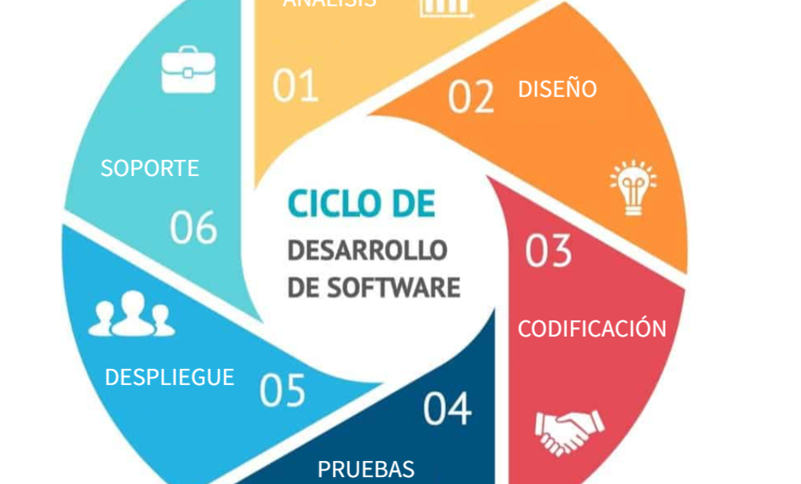

# Ejercicio 1

### ¿Qué es es un programa informatico?

Un programa informatico es una serie de instrucciones claras que se le da al ordenador a realizar tareas 

### Diferencias entre código

- **Codigo Fuente**: Es el texto hecho por el programador
- **Codigo Objeto**: traducido para que la maquina lo entienda e interprete, suele estar en binario
- **Codigo Ejecutable**: Es el código fuente ya empaquetado para iniciarse en un exe 

## Etapas del desarrollo del Software

